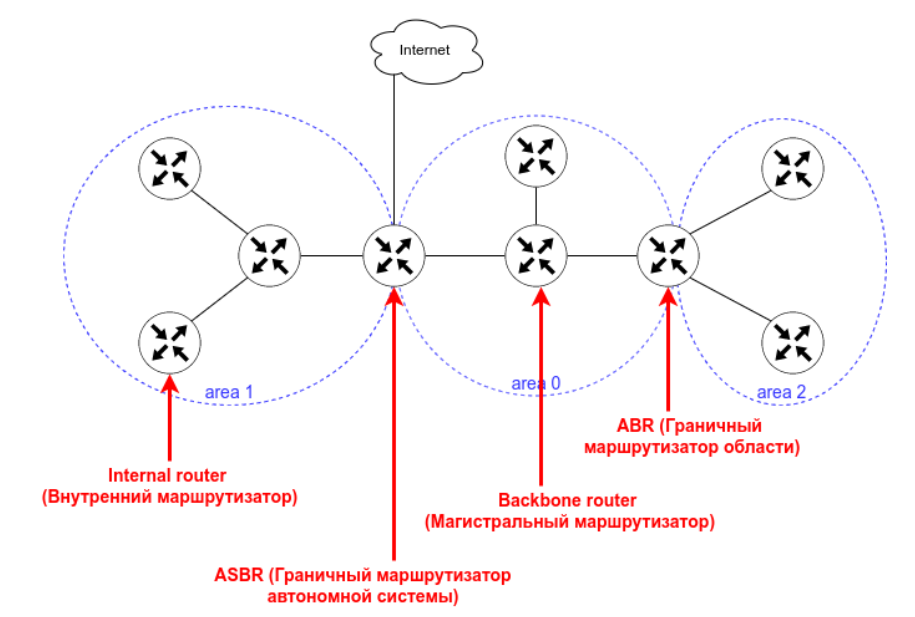
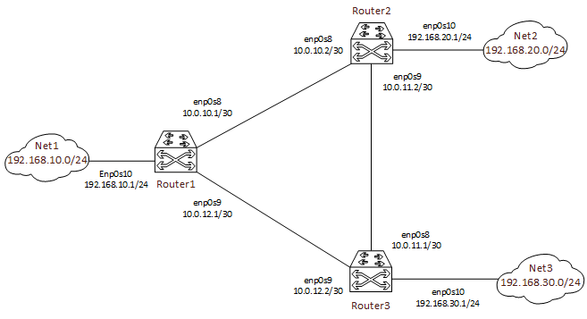

# Домашнее задание Vagrant-стенд c OSPF.

## Цель домашнего задания  
Создать домашнюю сетевую лабораторию. Научится настраивать протокол OSPF в Linux-based системах.

### Описание домашнего задания  

Что нужно сделать?

1. Развернуть 3 виртуальные машины   
2. Объединить их разными vlan    
- настроить OSPF между машинами на базе Quagga;   
- изобразить ассиметричный роутинг;    
- сделать один из линков "дорогим", но что бы при этом роутинг был симметричным.    
    

Формат сдачи ДЗ - vagrant + ansible        

## Введение    

OSPF — протокол динамической маршрутизации, использующий концепцию разделения на области в целях масштабирования.    
Административная дистанция OSPF — 110    
Основные свойства протокола OSPF:    
Быстрая сходимость    
Масштабируемость (подходит для маленьких и больших сетей)    
Безопасность (поддежка аутентиикации)    
Эффективность (испольование алгоритма поиска кратчайшего пути)    

При настроенном OSPF маршрутизатор формирует таблицу топологии с использованием результатов вычислений, основанных на алгоритме кратчайшего пути (SPF)    
Дейкстры. Алгоритм поиска кратчайшего пути основывается на данных о совокупной стоимости доступа к точке назначения. Стоимость доступа определятся на основе скорости интерфейса.     
Чтобы повысить эффективность и масштабируемость OSPF, протокол поддерживает иерархическую маршрутизацию с помощью областей (area).     
Область OSPF (area) — Часть сети, которой ограничивается формирование базы данных о состоянии каналов. Маршрутизаторы, находящиеся в одной и той же области, имеют одну и ту же базу данных о топологии сети. Для определения областей применяются идентификаторы областей.    
Протоколы OSPF бвывают 2-х версий:     
    • OSPFv2    
    • OSPFv3    
Основным отличием протоколов является то, что OSPFv2 работает с IPv4, а OSPFv3 — c IPv6.     
Маршрутизаторы в OSPF клаlссифицируются на основе выполняемой ими функции:    



- Internal router (внутренний маршрутизатор) — маршрутизатор, все интерфейсы которого находятся в одной и той же области.    
- Backbone router (магистральный маршрутизатор) — это маршрутизатор, который находится в магистральной зоне (area 0).    
- ABR (пограничный маргрутизатор области) — маршрутизатор, интерфейсы которого подключены к разным областям.    
- ASBR (Граничный маршрутизатор автономной системы) — это маршрутизатор, у которого интерфейс подключен к внешней сети.    
Также с помощью OSPF можно настроить ассиметричный роутинг.    
Ассиметричная маршрутизация — возможность пересекать сеть в одном направлении, используя один путь, и возвращаться через другой путь.    

# Выполнение:  

### 1. С помощью vagrant развернем тестовый стенд:  
<table>
  <tr>
    <th>Название</th>
    <th>Интерфейс</th>
    <th>IP-адрес</th>
    <th>Описание</th>
  </tr>
  <tr>
    <th rowspan="3">router1</th>
    <td>enp0s8</td>
    <td>10.0.10.1/30</td>
    <td>router1 - router2</td>
  </tr>
    <td>enp0s9</td>
    <td>10.0.12.1/30</td>
    <td>router1 - router3</td>
  </tr>
  </tr>
    <td>enp0s10</td>
    <td>192.168.10.1/24</td>
    <td>Локальная сеть net1</td>
  </tr>
   <tr>
    <td colspan="3"></td>
  </tr>
  <tr>
    <th rowspan="3">router2</th>
    <td>enp0s8</td>
    <td>10.0.10.2/30</td>
    <td>router1 - router2</td>
  </tr>
    <td>enp0s9</td>
    <td>10.0.11.2/30</td>
    <td>router2 - router3</td>
  </tr>
  </tr>
    <td>enp0s10</td>
    <td>192.168.20.1/24</td>
    <td>Локальная сеть net2</td>
  </tr>
   <tr>
    <td colspan="3"></td>
  </tr>
  <tr>
    <th rowspan="3">router3</th>
    <td>enp0s8</td>
    <td>10.0.11.1/30</td>
    <td>router2 - router3</td>
  </tr>
    <td>enp0s9</td>
    <td>10.0.12.2/30</td>
    <td>router1 - router3</td>
  </tr>
  </tr>
    <td>enp0s10</td>
    <td>192.168.30.1/24</td>
    <td>Локальная сеть net3</td>
  </tr>
</table>
  
Виртуаульные машины соединены между собой подсетями *10.0.10.0/30*, *10.0.11.0/30* и *10.0.12.0/30*.  
У каждого устройства есть дополнительная сеть *192.168.10.0/24*, *192.168.20.0/24* и *192.168.30.0/24* соответственно.  
  
Исходя из этого построим карту сети:

    

## 2. Настройка OSPF

#### 2.1. Настройка OSPF осуществляется на основе FRR. Установка данного пакета и конфигурирование серверов осуществляется с помощью ansible    
После развертывания стенда vagrant, запустил ansible-playbook ospf.yml    

```shell
root@ansible:/home/vagrant/ansible# ansible-playbook ospf.yml

PLAY [OSPF] ***************************************************************************************************

TASK [Gathering Facts] ****************************************************************************************
ok: [router3]
ok: [router1]
ok: [router2]
...
PLAY RECAP ****************************************************************************************************
router1                    : ok=11   changed=10   unreachable=0    failed=0    skipped=0    rescued=0    ignored=0
router2                    : ok=11   changed=10   unreachable=0    failed=0    skipped=0    rescued=0    ignored=0
router3                    : ok=11   changed=10   unreachable=0    failed=0    skipped=0    rescued=0    ignored=0
```    
Playbook'и отработал без ошибок    

   

#### 2.2. Проверяю, что OSPF поднялся и работает корректно    
На router1 проверяю таблицу маршрутизции OSPF   

```shell
root@router1:~# vtysh

Hello, this is FRRouting (version 10.2.1).
Copyright 1996-2005 Kunihiro Ishiguro, et al.

router1# sh ip ospf route
============ OSPF network routing table ============
N    10.0.10.0/30          [100] area: 0.0.0.0
                           directly attached to enp0s8
N    10.0.11.0/30          [200] area: 0.0.0.0
                           via 10.0.12.2, enp0s9
                           via 10.0.10.2, enp0s8
N    10.0.12.0/30          [100] area: 0.0.0.0
                           directly attached to enp0s9
N    192.168.10.0/24       [100] area: 0.0.0.0
                           directly attached to enp0s10
N    192.168.20.0/24       [200] area: 0.0.0.0
                           via 10.0.10.2, enp0s8
N    192.168.30.0/24       [200] area: 0.0.0.0
                           via 10.0.12.2, enp0s9

============ OSPF router routing table =============

============ OSPF external routing table ===========
```   

Выполнил ping и traceroute до сети 192.168.30.0/24, которая передаётся в OSPF с router3   

```shell
router1# ping 192.168.30.1
PING 192.168.30.1 (192.168.30.1) 56(84) bytes of data.
64 bytes from 192.168.30.1: icmp_seq=1 ttl=64 time=0.387 ms
64 bytes from 192.168.30.1: icmp_seq=2 ttl=64 time=0.498 ms
64 bytes from 192.168.30.1: icmp_seq=3 ttl=64 time=0.518 ms
^C
--- 192.168.30.1 ping statistics ---
3 packets transmitted, 3 received, 0% packet loss, time 2030ms
rtt min/avg/max/mdev = 0.387/0.467/0.518/0.057 ms

router1# traceroute 192.168.30.1
traceroute to 192.168.30.1 (192.168.30.1), 30 hops max, 60 byte packets
 1  192.168.30.1 (192.168.30.1)  0.427 ms  0.380 ms  0.334 ms
```
OSPF работает.   

#### 2.3. Далее проверяю как изменится маршрут до этой же сети, если отключить прямой линк между router1 и router3    
На router1 отключаю интерфейс enp0s9, выполняю ещё раз traceroute   

```shell
router1# sh int br
Interface       Status  VRF             Addresses
---------       ------  ---             ---------
enp0s3          up      default         10.0.2.15/24
                                        + fd00::62:ccff:fe58:3664/64
enp0s8          up      default         10.0.10.1/30
                                        fe80::a00:27ff:fed4:3175/64
enp0s9          up      default         10.0.12.1/30
                                        fe80::a00:27ff:fe07:5a8b/64
enp0s10         up      default         192.168.10.1/24
                                        fe80::a00:27ff:fe57:e6d/64
enp0s16         up      default         192.168.57.10/24
                                        fe80::a00:27ff:fec6:3b57/64
lo              up      default

router1# conf t
router1(config)# int enp0s9
router1(config-if)# shutdown
router1(config-if)# do traceroute 192.168.30.1
traceroute to 192.168.30.1 (192.168.30.1), 30 hops max, 60 byte packets
 1  10.0.10.2 (10.0.10.2)  0.491 ms  0.425 ms  0.321 ms
 2  192.168.30.1 (192.168.30.1)  0.626 ms  0.524 ms  0.574 ms
router1(config-if)# no shutdown
```   
Вывод команды traceroute показал, что OSPF отработал и трафик прошёл через router2   

## 3. Настройка ассиметричного роутинга   
#### 3.1. Для проверки асимметричного роутинга, необходимо сделать "дорогим" интерфейс enp0s8 на router1 - cost 1000. Таким образом, маршруты до других роутеров, в том числе router2 - будут менее приоритетными через данный интерфейс (чем меньше cost - тем приоритетней маршрут). Чтобы это проверить необходимо в файле defaults/main.yml изменить значение переменной symmetric_routing с empty на false. После этого запустить playbook с указанием тега - setup_ospf. В конфигурацию серверов будут внесены изменения, чтобы разрешить ассиметричный трафик - sysctl net.ipv4.conf.all.rp_filter=0   

```shell
root@ansible:/home/vagrant/ansible# ansible-playbook ospf.yml -t setup_ospf

PLAY [OSPF] ********************************************************************

TASK [Gathering Facts] *********************************************************
ok: [router2]
ok: [router3]
ok: [router1]

TASK [set up OSPF] *************************************************************
changed: [router3]
changed: [router2]
changed: [router1]

TASK [restart FRR] *************************************************************
changed: [router2]
changed: [router3]
changed: [router1]

PLAY RECAP *********************************************************************
router1                    : ok=3    changed=2    unreachable=0    failed=0    skipped=0    rescued=0    ignored=0
router2                    : ok=3    changed=2    unreachable=0    failed=0    skipped=0    rescued=0    ignored=0
router3                    : ok=3    changed=2    unreachable=0    failed=0    skipped=0    rescued=0    ignored=0
```   
Playbook'и отработал без ошибок   

Перехожу на router1   
```shell
root@router1:~# vtysh

Hello, this is FRRouting (version 10.2.1).
Copyright 1996-2005 Kunihiro Ishiguro, et al.

router1# show ip route ospf
Codes: K - kernel route, C - connected, L - local, S - static,
       R - RIP, O - OSPF, I - IS-IS, B - BGP, E - EIGRP, N - NHRP,
       T - Table, v - VNC, V - VNC-Direct, A - Babel, F - PBR,
       f - OpenFabric, t - Table-Direct,
       > - selected route, * - FIB route, q - queued, r - rejected, b - backup
       t - trapped, o - offload failure

O   10.0.10.0/30 [110/300] via 10.0.12.2, enp0s9, weight 1, 00:00:34
O>* 10.0.11.0/30 [110/200] via 10.0.12.2, enp0s9, weight 1, 00:00:39
O   10.0.12.0/30 [110/100] is directly connected, enp0s9, weight 1, 00:01:19
O   192.168.10.0/24 [110/100] is directly connected, enp0s10, weight 1, 00:01:19
O>* 192.168.20.0/24 [110/300] via 10.0.12.2, enp0s9, weight 1, 00:00:34
O>* 192.168.30.0/24 [110/200] via 10.0.12.2, enp0s9, weight 1, 00:00:39
```   

Теперь на router2    
```shell
root@router2:~# vtysh

Hello, this is FRRouting (version 10.2.1).
Copyright 1996-2005 Kunihiro Ishiguro, et al.

router2# sh ip route ospf
Codes: K - kernel route, C - connected, L - local, S - static,
       R - RIP, O - OSPF, I - IS-IS, B - BGP, E - EIGRP, N - NHRP,
       T - Table, v - VNC, V - VNC-Direct, A - Babel, F - PBR,
       f - OpenFabric, t - Table-Direct,
       > - selected route, * - FIB route, q - queued, r - rejected, b - backup
       t - trapped, o - offload failure

O   10.0.10.0/30 [110/100] is directly connected, enp0s8, weight 1, 00:03:04
O   10.0.11.0/30 [110/100] is directly connected, enp0s9, weight 1, 00:03:04
O>* 10.0.12.0/30 [110/200] via 10.0.10.1, enp0s8, weight 1, 00:02:19
  *                        via 10.0.11.1, enp0s9, weight 1, 00:02:19
O>* 192.168.10.0/24 [110/200] via 10.0.10.1, enp0s8, weight 1, 00:02:24
O   192.168.20.0/24 [110/100] is directly connected, enp0s10, weight 1, 00:03:04
O>* 192.168.30.0/24 [110/200] via 10.0.11.1, enp0s9, weight 1, 00:02:24
```   
И router3    
```shell
root@router3:~# vtysh

Hello, this is FRRouting (version 10.2.1).
Copyright 1996-2005 Kunihiro Ishiguro, et al.

router3# sh ip route ospf
Codes: K - kernel route, C - connected, L - local, S - static,
       R - RIP, O - OSPF, I - IS-IS, B - BGP, E - EIGRP, N - NHRP,
       T - Table, v - VNC, V - VNC-Direct, A - Babel, F - PBR,
       f - OpenFabric, t - Table-Direct,
       > - selected route, * - FIB route, q - queued, r - rejected, b - backup
       t - trapped, o - offload failure

O>* 10.0.10.0/30 [110/200] via 10.0.11.2, enp0s8, weight 1, 00:03:38
O   10.0.11.0/30 [110/100] is directly connected, enp0s8, weight 1, 00:04:18
O   10.0.12.0/30 [110/100] is directly connected, enp0s9, weight 1, 00:04:18
O>* 192.168.10.0/24 [110/200] via 10.0.12.1, enp0s9, weight 1, 00:03:33
O>* 192.168.20.0/24 [110/200] via 10.0.11.2, enp0s8, weight 1, 00:03:38
O   192.168.30.0/24 [110/100] is directly connected, enp0s10, weight 1, 00:04:18
```   

#### 3.2. После изменений конфигурации, проверяю как ходят пакеты   

```shell
root@router1:~# ping -I 192.168.10.1 192.168.20.1
PING 192.168.20.1 (192.168.20.1) from 192.168.10.1 : 56(84) bytes of data.
64 bytes from 192.168.20.1: icmp_seq=1 ttl=64 time=0.682 ms
64 bytes from 192.168.20.1: icmp_seq=2 ttl=64 time=0.722 ms
64 bytes from 192.168.20.1: icmp_seq=3 ttl=64 time=0.667 ms
^C
--- 192.168.20.1 ping statistics ---
3 packets transmitted, 3 received, 0% packet loss, time 2008ms
rtt min/avg/max/mdev = 0.667/0.690/0.722/0.023 ms
```    
#### 3.3. Теперь на router2 запускаю tcpdump, который будет смотреть трафик на enp0s8 и enp0s9   
Чтобы убедиться, что асимметричный роутинг работает, нужно запустить tcpdump на обоих интерфейсах router2 (enp0s8 и enp0s9)   
При этом также запустить ping с router1 до сети на router2    
```shell
root@router1:~# ping 192.168.20.1
PING 192.168.20.1 (192.168.20.1) 56(84) bytes of data.
64 bytes from 192.168.20.1: icmp_seq=1 ttl=64 time=0.855 ms
64 bytes from 192.168.20.1: icmp_seq=2 ttl=64 time=0.717 ms
64 bytes from 192.168.20.1: icmp_seq=3 ttl=64 time=0.886 ms
...
```   
```shell 
root@router2:~# tcpdump -i enp0s8 icmp
tcpdump: verbose output suppressed, use -v or -vv for full protocol decode
listening on enp0s8, link-type EN10MB (Ethernet), capture size 262144 bytes
13:13:50.032787 IP router2 > 10.0.12.1: ICMP echo reply, id 8, seq 18, length 64
13:13:51.034250 IP router2 > 10.0.12.1: ICMP echo reply, id 8, seq 19, length 64
13:13:52.049192 IP router2 > 10.0.12.1: ICMP echo reply, id 8, seq 20, length 64
13:13:53.072762 IP router2 > 10.0.12.1: ICMP echo reply, id 8, seq 21, length 64
13:13:54.074309 IP router2 > 10.0.12.1: ICMP echo reply, id 8, seq 22, length 64
13:13:55.075466 IP router2 > 10.0.12.1: ICMP echo reply, id 8, seq 23, length 64
13:13:56.080670 IP router2 > 10.0.12.1: ICMP echo reply, id 8, seq 24, length 64
13:13:57.081471 IP router2 > 10.0.12.1: ICMP echo reply, id 8, seq 25, length 64
13:13:58.096492 IP router2 > 10.0.12.1: ICMP echo reply, id 8, seq 26, length 64
13:13:59.120626 IP router2 > 10.0.12.1: ICMP echo reply, id 8, seq 27, length 64
^C
10 packets captured
10 packets received by filter
0 packets dropped by kernel
```   
Исходящие пакеты (ICMP reply) на enp0s8
```shell
root@router2:~# tcpdump -i enp0s9 icmp
tcpdump: verbose output suppressed, use -v or -vv for full protocol decode
listening on enp0s9, link-type EN10MB (Ethernet), capture size 262144 bytes
13:15:37.008780 IP 10.0.12.1 > router2: ICMP echo request, id 8, seq 123, length
 64
13:15:38.033152 IP 10.0.12.1 > router2: ICMP echo request, id 8, seq 124, length
 64
13:15:39.057181 IP 10.0.12.1 > router2: ICMP echo request, id 8, seq 125, length
 64
13:15:40.058078 IP 10.0.12.1 > router2: ICMP echo request, id 8, seq 126, length
 64
13:15:41.072822 IP 10.0.12.1 > router2: ICMP echo request, id 8, seq 127, length
 64
13:15:42.097518 IP 10.0.12.1 > router2: ICMP echo request, id 8, seq 128, length
 64
13:15:43.098865 IP 10.0.12.1 > router2: ICMP echo request, id 8, seq 129, length
 64
13:15:44.099654 IP 10.0.12.1 > router2: ICMP echo request, id 8, seq 130, length
 64
13:15:45.100406 IP 10.0.12.1 > router2: ICMP echo request, id 8, seq 131, length
 64
13:15:46.100523 IP 10.0.12.1 > router2: ICMP echo request, id 8, seq 132, length
 64
^C
10 packets captured
10 packets received by filter
0 packets dropped by kernel
```    
Входящие пакеты (ICMP request) на enp0s9    

### 4. Настройка симметичного роутинга   
Для того, чтобы сделать роутинг симметричным, необходимо выровнять cost на direct-link между router1 и router2. То есть на router2 также на интерфейсе enp0s8 выставить cost 1000. Для этого, необходимо в файле main.yml изменить значение переменной symmetric_routing с false на true. После этого необходимо запустить playbook, но с указание только тега - setup_ospf
   
```shell
root@ansible:/home/vagrant/ansible# ansible-playbook ospf.yml -t setup_ospf

PLAY [OSPF] ********************************************************************

TASK [Gathering Facts] *********************************************************
ok: [router3]
ok: [router2]
ok: [router1]

TASK [set up OSPF] *************************************************************
ok: [router3]
changed: [router2]
changed: [router1]

TASK [restart FRR] *************************************************************
changed: [router1]
changed: [router2]
changed: [router3]

PLAY RECAP *********************************************************************
router1                    : ok=3    changed=2    unreachable=0    failed=0    skipped=0    rescued=0    ignored=0
router2                    : ok=3    changed=2    unreachable=0    failed=0    skipped=0    rescued=0    ignored=0
router3                    : ok=3    changed=1    unreachable=0    failed=0    skipped=0    rescued=0    ignored=0
```    
Playbook'и отработал без ошибок    

*router1*
```shell
router1# show ip route ospf
Codes: K - kernel route, C - connected, L - local, S - static,
       R - RIP, O - OSPF, I - IS-IS, B - BGP, E - EIGRP, N - NHRP,
       T - Table, v - VNC, V - VNC-Direct, A - Babel, F - PBR,
       f - OpenFabric, t - Table-Direct,
       > - selected route, * - FIB route, q - queued, r - rejected, b - backup
       t - trapped, o - offload failure

O   10.0.10.0/30 [110/1000] is directly connected, enp0s8, weight 1, 00:01:05
O>* 10.0.11.0/30 [110/200] via 10.0.12.2, enp0s9, weight 1, 00:00:30
O   10.0.12.0/30 [110/100] is directly connected, enp0s9, weight 1, 00:01:05
O   192.168.10.0/24 [110/100] is directly connected, enp0s10, weight 1, 00:01:05
O>* 192.168.20.0/24 [110/300] via 10.0.12.2, enp0s9, weight 1, 00:00:25
O>* 192.168.30.0/24 [110/200] via 10.0.12.2, enp0s9, weight 1, 00:00:30
```    
*router2*    
```shell
router2# sh ip route ospf
Codes: K - kernel route, C - connected, L - local, S - static,
       R - RIP, O - OSPF, I - IS-IS, B - BGP, E - EIGRP, N - NHRP,
       T - Table, v - VNC, V - VNC-Direct, A - Babel, F - PBR,
       f - OpenFabric, t - Table-Direct,
       > - selected route, * - FIB route, q - queued, r - rejected, b - backup
       t - trapped, o - offload failure

O   10.0.10.0/30 [110/1000] is directly connected, enp0s8, weight 1, 00:01:50
O   10.0.11.0/30 [110/100] is directly connected, enp0s9, weight 1, 00:01:15
O>* 10.0.12.0/30 [110/200] via 10.0.11.1, enp0s9, weight 1, 00:01:10
O>* 192.168.10.0/24 [110/300] via 10.0.11.1, enp0s9, weight 1, 00:01:10
O   192.168.20.0/24 [110/100] is directly connected, enp0s10, weight 1, 00:01:50
O>* 192.168.30.0/24 [110/200] via 10.0.11.1, enp0s9, weight 1, 00:01:10
```   

#### 4.1. После изменения конфигурации на router2 проверяю, как ходят пакеты, запустив также ping c router1

```shell
root@router1:~# ping -I 192.168.10.1 192.168.20.1
PING 192.168.20.1 (192.168.20.1) from 192.168.10.1 : 56(84) bytes of data.
64 bytes from 192.168.20.1: icmp_seq=1 ttl=63 time=0.918 ms
64 bytes from 192.168.20.1: icmp_seq=2 ttl=63 time=0.903 ms
64 bytes from 192.168.20.1: icmp_seq=3 ttl=63 time=0.662 ms
^C
--- 192.168.20.1 ping statistics ---
3 packets transmitted, 3 received, 0% packet loss, time 2005ms
rtt min/avg/max/mdev = 0.662/0.827/0.918/0.117 ms
```   
#### 4.2. На router2 запускаю tcpdump, который будет смотреть трафик только на порту enp0s9    
Для этого опять запускаю ping с router1 на router2    

*router1*
```shell
root@router1:~# ping 192.168.20.1
PING 192.168.20.1 (192.168.20.1) 56(84) bytes of data.
64 bytes from 192.168.20.1: icmp_seq=1 ttl=63 time=1.25 ms
64 bytes from 192.168.20.1: icmp_seq=2 ttl=63 time=0.868 ms
64 bytes from 192.168.20.1: icmp_seq=3 ttl=63 time=0.671 ms
^C
--- 192.168.20.1 ping statistics ---
3 packets transmitted, 3 received, 0% packet loss, time 2003ms
rtt min/avg/max/mdev = 0.671/0.930/1.253/0.241 ms
```   

*router2*    
```shell
root@router2:~# tcpdump -i enp0s9
tcpdump: verbose output suppressed, use -v or -vv for full protocol decode
listening on enp0s9, link-type EN10MB (Ethernet), capture size 262144 bytes
16:16:02.704575 IP 10.0.12.1 > router2: ICMP echo request, id 10, seq 7, length
64
16:16:02.704621 IP router2 > 10.0.12.1: ICMP echo reply, id 10, seq 7, length 64
16:16:03.728830 IP 10.0.12.1 > router2: ICMP echo request, id 10, seq 8, length
64
16:16:03.728877 IP router2 > 10.0.12.1: ICMP echo reply, id 10, seq 8, length 64
16:16:04.752667 IP 10.0.12.1 > router2: ICMP echo request, id 10, seq 9, length
64
16:16:04.752700 IP router2 > 10.0.12.1: ICMP echo reply, id 10, seq 9, length 64
16:16:05.776794 IP 10.0.12.1 > router2: ICMP echo request, id 10, seq 10, length
 64
16:16:05.776822 IP router2 > 10.0.12.1: ICMP echo reply, id 10, seq 10, length 6
4
16:16:06.801101 IP 10.0.12.1 > router2: ICMP echo request, id 10, seq 11, length
 64
16:16:06.801132 IP router2 > 10.0.12.1: ICMP echo reply, id 10, seq 11, length 6
4
16:16:07.802627 IP 10.0.12.1 > router2: ICMP echo request, id 10, seq 12, length
 64
16:16:07.802653 IP router2 > 10.0.12.1: ICMP echo reply, id 10, seq 12, length 6
4
16:16:08.816514 IP 10.0.12.1 > router2: ICMP echo request, id 10, seq 13, length
 64
16:16:08.816561 IP router2 > 10.0.12.1: ICMP echo reply, id 10, seq 13, length 6
4
16:16:09.606955 IP 10.0.11.1 > ospf-all.mcast.net: OSPFv2, Hello, length 48
16:16:09.609568 IP router2 > ospf-all.mcast.net: OSPFv2, Hello, length 48
16:16:09.840437 IP 10.0.12.1 > router2: ICMP echo request, id 10, seq 14, length
 64
16:16:09.840480 IP router2 > 10.0.12.1: ICMP echo reply, id 10, seq 14, length 6
4
16:16:10.864658 IP 10.0.12.1 > router2: ICMP echo request, id 10, seq 15, length
 64
16:16:10.864689 IP router2 > 10.0.12.1: ICMP echo reply, id 10, seq 15, length 6
4
^C
20 packets captured
20 packets received by filter
0 packets dropped by kernel
```    
Вывод tcpdump показывает, что трафик между router1 (IP-адрес 10.0.12.1) и router2 проходит через интерфейс enp0s9. При этом:    
ICMP-запросы (echo request) идут от 10.0.12.1 (router1) к router2.    
ICMP-ответы (echo reply) идут от router2 к 10.0.12.1 (router1).     
Это указывает на то, что трафик в обоих направлениях проходит через один и тот же интерфейс (enp0s9), что является признаком симметричного маршрутирования

__________________   

end